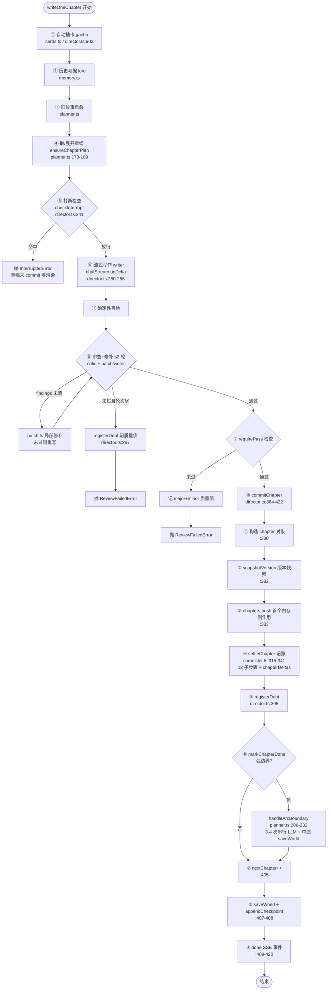
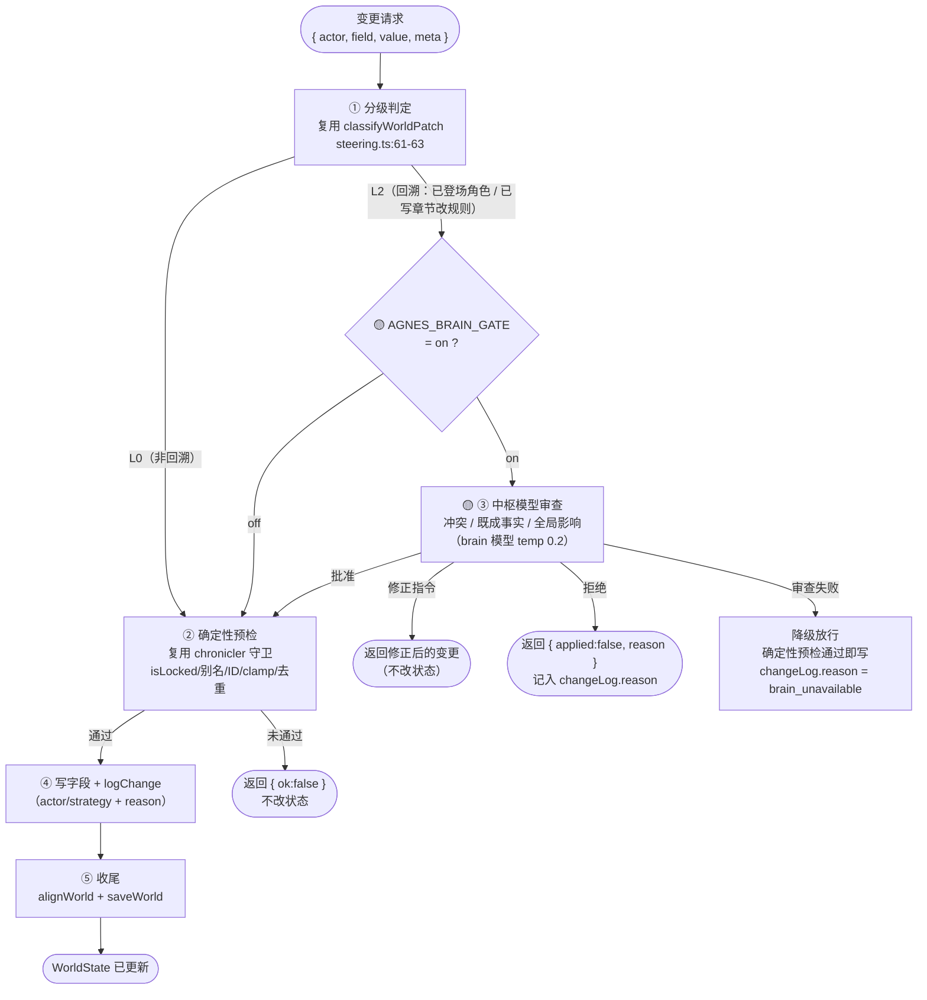
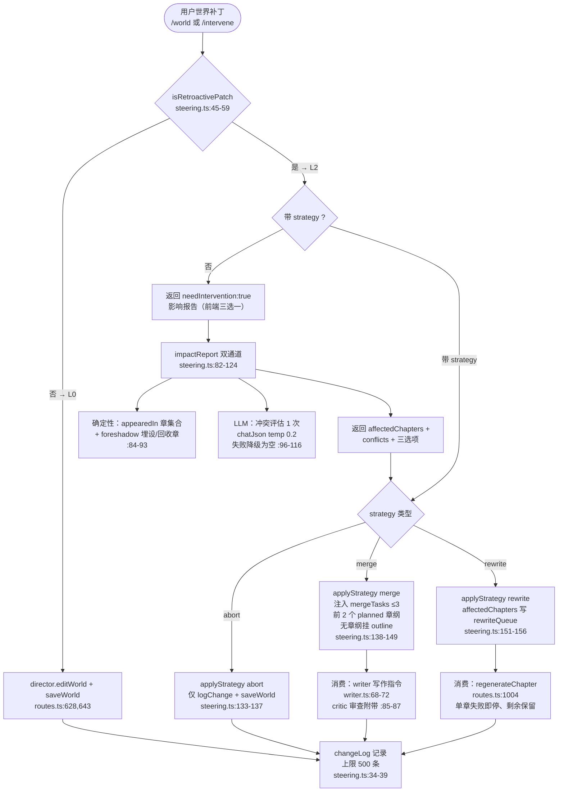

# 可视化 flow（FLOWS）

> 前置文档：[docs/ARCHITECTURE.md](./ARCHITECTURE.md)（设计基线）、[docs/DEEP-DIVE.md](./DEEP-DIVE.md)（细致分析，本文的图是其中各节的图示化）、[docs/COUPLING.md](./COUPLING.md)（指令 → UI 更新映射与媒体资源耦合）
> 渲染：Mermaid（GitHub / VS Code 直接渲染）。图例统一：
> - `flowchart` 节点：矩形=过程，菱形=判定，圆角=起止/终态
> - `sequenceDiagram`：实线箭头=同步调用，虚线箭头=返回
> - 高亮色：🟢 现状已有、🟡 目标态新增（中枢模型/闸门）、🔴 风险/失败路径

---

## flow 1：现状 writeOneChapter 完整管线（flowchart）

> 对应 DEEP-DIVE 1.6 与 ARCHITECTURE 1.3。展示 `director.writeOneChapter` 全流程：写作、审查循环、commitChapter 九步。

**要点**：流式写作（⑥）先于 commitChapter（⑩）完成，因此 commit 内任何审查插入点都不破坏低延迟流式；`handleArcBoundary`（K7）是主链路上最大延迟源（3-4 次串行 LLM），且失败被 catch 后不自动重试（DEEP-DIVE 1.2）。

---

## flow 2：目标态 writeOneChapter + 主脑审查（sequenceDiagram）

> 对应 DEEP-DIVE 1.1（章末审查 P1 窗口）与 1.2（弧边界审批）。🟡 为新增中枢模型介入点。

```mermaid
sequenceDiagram
    autonumber
    participant D as director.writeOneChapter
    participant W as writer
    participant C as critic
    participant CH as chronicler
    participant B as 🟡 brain 中枢模型
    participant P as planner

    D->>W: 写作指令（含 mergeTasks 弥合任务）
    W-->>D: 流式草稿（chatStream）
    D->>C: 审查 + 修补循环 ≤2 轮
    C-->>D: findings / 通过

    Note over D,CH: 进入 commitChapter
    D->>CH: settleChapter 记账（temp 0.2）
    CH-->>D: report.delta（含全部旧值快照）

    Note over D,B: 🟡 P1 审查窗口（DEEP-DIVE 1.1）
    D->>B: 章末一致性审查（正文 + delta + 活跃伏笔/弧线/计划）
    alt 批准
        B-->>D: ✅ 批准
    else 修正指令
        B-->>D: 🟡 修正指令
        D->>D: 注入 mergeTasks（复用 steering merge 语义）
    else 否决
        B-->>D: ❌ 否决
        D->>CH: applyChapterDeltaRevert 回滚账本<br/>(integrity.ts:31-133)
        D->>D: 移除 chapters 条目 + chapterSummaries[index]
        D-->>C: 回到审查/重写流程
    end

    D->>D: registerDebt
    D->>P: markChapterDone
    alt 弧边界
        Note over D,P: 🟡 弧边界审批（DEEP-DIVE 1.2，建议拆出主序列）
        D->>B: 审批弧/卷展开方向
        B-->>D: ✅ 放行 / 修正
        D->>P: summarizeRange / updateCompass / expandArc
    end
    D->>D: nextChapter++ / saveWorld + checkpoint
    D-->>D: done SSE 事件
```

**要点**：中枢模型只做决策/审批，不写正文；否决路径依赖 `chapterDeltas`（P1 窗口内存可回滚，未持久化）；弧边界审批建议在 `expandArc`（内部 `saveWorld`）之前。

---

## flow 3：applyStateChange 状态变更闸门（flowchart）

> 对应 DEEP-DIVE 第 2 章。所有写 WorldState 的路径收敛到单一接口，闸门默认 off 零行为变化。

**要点**：L0 直通（低开销）；L2 才触发闸门；审查失败降级放行（闸门是"加保险"非"拦路虎"）；收尾统一 alignWorld（现状仅 3 端点对齐，见 DEEP-DIVE 3.3）。

---

## flow 4：steering L2 干预治理（flowchart）

> 对应 DEEP-DIVE 4（复用清单）与 ARCHITECTURE 2.2。现状已实现，是 applyStateChange 策略落地的参照。

**要点**：分级只产出 L0/L2（L1/L3 预留枚举）；mergeTasks 与 rewriteQueue 是干预落地的两条消费通道，已被 writer/critic 贯通——中枢模型的修正指令可直接复用同一通道（DEEP-DIVE 第 4 章复用清单）。

---

## 图与文档交叉索引

| 图 | 对应 DEEP-DIVE 章节 | 对应 ARCHITECTURE 章节 |
|---|---|---|
| flow 1 | 1.6（commitChapter 审查点） | 1.3（单章管线） |
| flow 2 | 1.1（章末审查）、1.2（弧边界审批） | 3.3（中枢职责） |
| flow 3 | 2（applyStateChange 设计） | 3.6（状态变更收敛） |
| flow 4 | 4（复用清单） | 2.2（状态变更多写者） |
